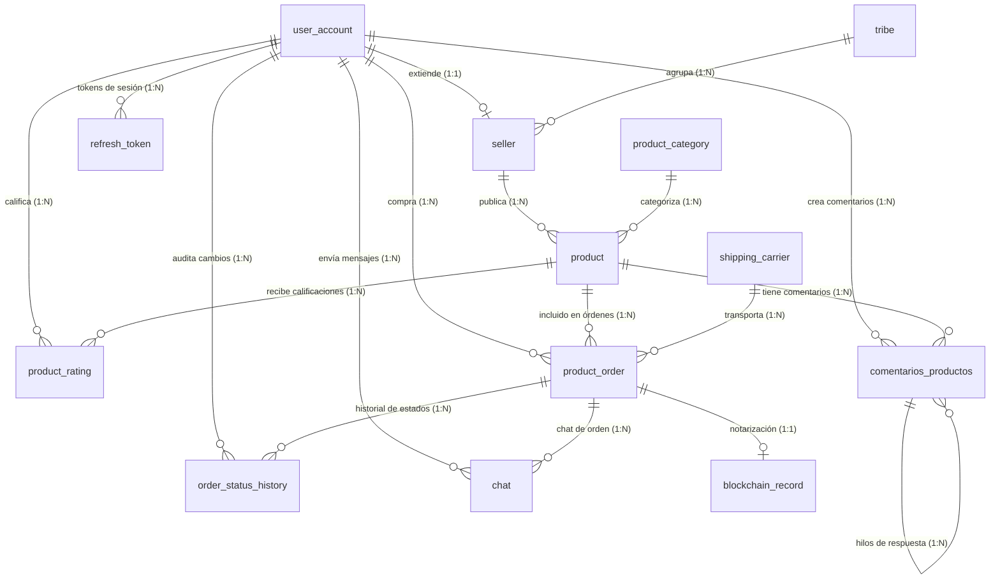

# Diagrama y Documentación del Esquema de Base de Datos (API)

Este documento detalla la estructura completa de la base de datos PostgreSQL + PostGIS utilizada por el servicio API de **AmazonIA Marketplace**, extraída directamente de su esquema de Prisma ([schema.prisma](file:///c:/Users/pc2/Documents/projects/amazonIA-marketplace/apps/api/prisma/schema.prisma)).

---

## 📊 Diagrama de Entidad-Relación (MER)

A continuación se muestra cómo se relacionan las tablas principales del sistema.

---

## 🗂️ Definición de Tablas

### 1. `user_account` (Modelo `UserAccount`)
Representa a todos los usuarios del sistema (compradores, vendedores y administradores).

| Campo | Tipo Prisma | Tipo PostgreSQL | Restricciones | Descripción / Mapeo |
| :--- | :--- | :--- | :--- | :--- |
| `id` | `String` | `uuid` | `@id`, `default(gen_random_uuid())` | Identificador único del usuario. |
| `username` | `String?` | `varchar(50)` | `@unique`, Opcional | Nombre de usuario único. |
| `fullName` | `String` | `varchar(255)` | Requerido | Nombre completo del usuario (`full_name`). |
| `nationalId` | `String` | `varchar(50)` | `@unique`, Requerido | Cédula o número de identidad nacional (`national_id`). |
| `age` | `Int?` | `integer` | Opcional | Edad del usuario. |
| `nationality`| `String?` | `varchar(100)` | Opcional | Nacionalidad del usuario. |
| `passwordHash`| `String` | `varchar(255)` | Requerido | Hash de la contraseña (`password_hash`). |
| `email` | `String` | `varchar(255)` | `@unique`, Requerido | Correo electrónico de contacto. |
| `role` | `UserRole` | `user_role_enum`| `default(BUYER)` | Rol en la plataforma (BUYER, SELLER, ADMIN). |
| `phonePrimary`| `String?` | `varchar(50)` | Opcional | Teléfono principal (`phone_primary`). |
| `phoneSecondary`| `String?`| `varchar(50)` | Opcional | Teléfono secundario (`phone_secondary`). |
| `walletHash` | `String?` | `varchar(255)` | Opcional | Hash de la billetera criptográfica (`wallet_hash`). |
| `locationCoords`| `Unsupported`| `geography(Point, 4326)`| Opcional, Gist Index | Coordenadas espaciales PostGIS (`location_coords`). |
| `locationMapboxId`| `String?`| `varchar(100)`| Opcional | ID de Mapbox (`location_mapbox_id`). |
| `locationFormattedAddress`| `String?`| `text`| Opcional | Dirección legible (`location_formatted_address`). |
| `locationCity`| `String?` | `varchar(100)`| Opcional | Ciudad de ubicación (`location_city`). |
| `locationRegion`| `String?`| `varchar(100)`| Opcional | Región/Estado de ubicación (`location_region`). |
| `createdAt` | `DateTime` | `timestamptz` | `default(now())` | Fecha de registro (`created_at`). |

---

### 2. `seller` (Modelo `Seller`)
Extensión del modelo `UserAccount` para usuarios que son vendedores (Relación 1:1).

| Campo | Tipo Prisma | Tipo PostgreSQL | Restricciones | Descripción / Mapeo |
| :--- | :--- | :--- | :--- | :--- |
| `id` | `String` | `uuid` | `@id` | Comparte el mismo UUID que `user_account.id`. Cascade Delete. |
| `tribeId` | `Int?` | `integer` | Opcional, SetNull | ID de la tribu a la que pertenece (`tribe_id`). |
| `rating` | `Int?` | `integer` | Opcional | Calificación manual o heredada. |
| `description`| `String?` | `text` | Opcional | Descripción comercial del vendedor. |
| `avgProductRating`| `Float?`| `double precision`| Opcional | Promedio de calificación de productos (`avg_product_rating`). |
| `totalReviews`| `Int` | `integer` | `default(0)` | Total de reseñas recibidas (`total_reviews`). |

---

### 3. `tribe` (Modelo `Tribe`)
Representa comunidades indígenas o tribus a las que los vendedores pertenecen.

| Campo | Tipo Prisma | Tipo PostgreSQL | Restricciones | Descripción / Mapeo |
| :--- | :--- | :--- | :--- | :--- |
| `id` | `Int` | `serial` | `@id`, Autoincrement | ID único de la tribu. |
| `name` | `String` | `varchar(255)` | Requerido | Nombre de la comunidad/tribu. |
| `description`| `String?` | `text` | Opcional | Reseña o descripción de la tribu. |
| `locationCoords`| `Unsupported`| `geography(Point, 4326)`| Opcional | Coordenadas PostGIS del asentamiento (`location_coords`). |
| `locationMapboxId`| `String?`| `varchar(100)`| Opcional | ID de Mapbox (`location_mapbox_id`). |
| `locationFormattedAddress`| `String?`| `text`| Opcional | Dirección formateada de la tribu (`location_formatted_address`). |

---

### 4. `product_category` (Modelo `ProductCategory`)
Definición jerárquica de categorías para la clasificación de productos.

| Campo | Tipo Prisma | Tipo PostgreSQL | Restricciones | Descripción / Mapeo |
| :--- | :--- | :--- | :--- | :--- |
| `id` | `Int` | `serial` | `@id`, Autoincrement | ID único de la categoría. |
| `categoryName`| `String` | `varchar(100)` | Requerido | Nombre de la categoría padre (`category_name`). |
| `subcategoryName`| `String?`| `varchar(100)`| Opcional | Nombre de la subcategoría (`subcategory_name`). |

---

### 5. `product` (Modelo `Product`)
Catalogo de productos artesanales y naturales publicados por los vendedores.

| Campo | Tipo Prisma | Tipo PostgreSQL | Restricciones | Descripción / Mapeo |
| :--- | :--- | :--- | :--- | :--- |
| `id` | `String` | `uuid` | `@id`, `default(gen_random_uuid())` | Identificador único del producto. |
| `sellerId` | `String` | `uuid` | Requerido, Index | Propietario del producto (`seller_id`). Relación Cascade. |
| `categoryId` | `Int` | `integer` | Requerido | Categoría asignada (`category_id`). |
| `name` | `String` | `varchar(255)` | Requerido | Nombre comercial del producto. |
| `description`| `String?` | `text` | Opcional | Ficha técnica o descripción del producto. |
| `price` | `Decimal` | `numeric(12,2)`| Requerido | Precio de venta. |
| `stockAvailable`| `Int` | `integer` | `default(0)` | Inventario disponible (`stock_available`). |
| `imageUrl` | `String?` | `text` | Opcional | Enlace a la imagen ilustrativa (`image_url`). |
| `averageRating`| `Decimal?`| `numeric(3,2)` | Opcional | Calificación promedio (`average_rating`). |
| `totalReviews`| `Int` | `integer` | `default(0)` | Total de reseñas evaluadas (`total_reviews`). |
| `locationCoords`| `Unsupported`| `geography(Point, 4326)`| Opcional, Gist Index | Ubicación geográfica de disponibilidad (`location_coords`). |
| `locationMapboxId`| `String?`| `varchar(100)`| Opcional | ID de Mapbox (`location_mapbox_id`). |
| `locationFormattedAddress`| `String?`| `text`| Opcional | Dirección legible de envío de origen. |
| `locationCity`| `String?` | `varchar(100)`| Opcional | Ciudad origen. |
| `locationRegion`| `String?`| `varchar(100)`| Opcional | Región origen. |
| `createdAt` | `DateTime` | `timestamptz` | `default(now())` | Fecha de creación (`created_at`). |
| `updatedAt` | `DateTime` | `timestamptz` | `@updatedAt` | Última actualización (`updated_at`). |

---

### 6. `product_rating` (Modelo `ProductRating`)
Tabla pivot para calificaciones de productos por parte de usuarios. Evita duplicidad de voto (PK compuesta).

| Campo | Tipo Prisma | Tipo PostgreSQL | Restricciones | Descripción / Mapeo |
| :--- | :--- | :--- | :--- | :--- |
| `productId` | `String` | `uuid` | `@id` (Compuesta) | Producto evaluado (`product_id`). Relación Cascade. |
| `userAccountId`| `String` | `uuid` | `@id` (Compuesta) | Usuario que califica (`user_account_id`). Relación Cascade. |
| `ratingValue`| `Int` | `integer` | Requerido | Calificación numérica otorgada (`rating_value`). |
| `createdAt` | `DateTime` | `timestamptz` | `default(now())` | Fecha de la valoración (`created_at`). |

---

### 7. `comentarios_productos` (Modelo `ProductComment`)
Comentarios, consultas públicas e hilos de respuestas por producto.

| Campo | Tipo Prisma | Tipo PostgreSQL | Restricciones | Descripción / Mapeo |
| :--- | :--- | :--- | :--- | :--- |
| `id` | `Int` | `serial` | `@id`, Autoincrement | Identificador del comentario (`id_comentario`). |
| `productId` | `String` | `uuid` | Requerido | Relación al producto (`id_producto`). Relación Cascade. |
| `userId` | `String` | `uuid` | Requerido | Usuario emisor (`id_usuario`). Relación Cascade. |
| `content` | `String` | `text` | Requerido | Contenido del texto (`comentario`). |
| `parentCommentId`| `Int?` | `integer` | Opcional | ID del comentario padre en caso de respuesta (`id_respuesta`). |
| `publishedAt`| `DateTime` | `timestamptz` | `default(now())` | Fecha de publicación (`fh_publicacion`). |

---

### 8. `shipping_carrier` (Modelo `ShippingCarrier`)
Empresas registradas para la gestión de envíos físicos.

| Campo | Tipo Prisma | Tipo PostgreSQL | Restricciones | Descripción / Mapeo |
| :--- | :--- | :--- | :--- | :--- |
| `id` | `Int` | `serial` | `@id`, Autoincrement | Identificador único del transportista. |
| `name` | `String` | `varchar(100)` | `@unique`, Requerido | Nombre legal/comercial del carrier. |
| `website` | `String?` | `varchar(255)` | Opcional | Sitio web de tracking de la empresa. |

---

### 9. `product_order` (Modelo `ProductOrder`)
Transacciones y órdenes de compra de productos generadas por los compradores.

| Campo | Tipo Prisma | Tipo PostgreSQL | Restricciones | Descripción / Mapeo |
| :--- | :--- | :--- | :--- | :--- |
| `id` | `String` | `uuid` | `@id`, `default(gen_random_uuid())` | UUID único de la orden de compra. |
| `productId` | `String` | `uuid` | Requerido | Producto comprado (`product_id`). |
| `buyerId` | `String` | `uuid` | Requerido, Index | Comprador (`buyer_id`). |
| `quantity` | `Int` | `integer` | Requerido | Cantidad de unidades ordenadas. |
| `totalAmount`| `Decimal` | `numeric(12,2)`| Requerido | Monto monetario total (`total_amount`). |
| `orderNotes` | `String?` | `text` | Opcional | Instrucciones especiales (`order_notes`). |
| `trackingNumber`| `String?`| `varchar(100)`| Opcional | Código de seguimiento físico (`tracking_number`). |
| `carrierId` | `Int?` | `integer` | Opcional | Transportista asignado (`carrier_id`). |
| `sellerRatingValue`| `Int?`| `integer` | Opcional | Puntuación dada por el comprador al vendedor (`seller_rating_value`). |
| `buyerRatingValue`| `Int?` | `integer` | Opcional | Puntuación dada por el vendedor al comprador (`buyer_rating_value`). |
| `transactionHash`| `String?`| `varchar(255)`| Opcional | Hash de blockchain si se paga cripto (`transaction_hash`). |
| `currentStatus`| `OrderStatus`| `order_status_enum`| `default(PENDING)`, Index | Estado logístico actual (`current_status`). |
| `createdAt` | `DateTime` | `timestamptz` | `default(now())` | Fecha de creación (`created_at`). |
| `updatedAt` | `DateTime` | `timestamptz` | `@updatedAt` | Última actualización de estado (`updated_at`). |

---

### 10. `order_status_history` (Modelo `OrderStatusHistory`)
Log transaccional seguro (Append-Only) para auditoría e historial del estado de los pedidos.

| Campo | Tipo Prisma | Tipo PostgreSQL | Restricciones | Descripción / Mapeo |
| :--- | :--- | :--- | :--- | :--- |
| `id` | `Int` | `serial` | `@id`, Autoincrement | Registro autoincremental de auditoría. |
| `orderId` | `String` | `uuid` | Requerido, Index | Pedido afectado (`order_id`). Relación Cascade. |
| `changedByUserId`| `String`| `uuid` | Requerido | Usuario que efectúa el cambio (`changed_by_user_id`). |
| `previousStatus`| `OrderStatus?`| `order_status_enum`| Opcional | Estado previo a la transición (`previous_status`). |
| `newStatus` | `OrderStatus`| `order_status_enum`| Requerido | Estado nuevo de la transición (`new_status`). |
| `statusNote` | `String?` | `text` | Opcional | Justificación del cambio (`status_note`). |
| `createdAt` | `DateTime` | `timestamptz` | `default(now())`, Index | Fecha y hora del cambio de estado (`created_at`). |

---

### 11. `chat` (Modelo `OrderChat`)
Mensajería directa y privada asociada a un pedido entre comprador y vendedor.

| Campo | Tipo Prisma | Tipo PostgreSQL | Restricciones | Descripción / Mapeo |
| :--- | :--- | :--- | :--- | :--- |
| `id` | `Int` | `serial` | `@id`, Autoincrement | ID del mensaje (`id_mensaje`). |
| `orderId` | `String` | `uuid` | Requerido, Index | Pedido asociado (`id_pedido`). Relación Cascade. |
| `senderId` | `String` | `uuid` | Requerido | Usuario emisor (`id_remitente`). Relación Cascade. |
| `message` | `String` | `text` | Requerido | Cuerpo del mensaje (`mensaje`). |
| `sentAt` | `DateTime` | `timestamptz` | `default(now())`, Index | Fecha de envío (`fh_envio`). |

---

### 12. `outbox_events` (Modelo `OutboxEvent`)
Patrón Transaccional Outbox para garantizar la publicación confiable de eventos asíncronos hacia Redis Streams.

| Campo | Tipo Prisma | Tipo PostgreSQL | Restricciones | Descripción / Mapeo |
| :--- | :--- | :--- | :--- | :--- |
| `id` | `String` | `uuid` | `@id`, `default(gen_random_uuid())` | Identificador único del evento. |
| `aggregateType`| `String` | `varchar(100)`| Requerido | Entidad origen o agregada (`aggregate_type`). |
| `aggregateId`| `String` | `uuid` | Requerido | ID UUID del registro afectado (`aggregate_id`). |
| `eventType` | `String` | `varchar(100)`| Requerido | Nombre del evento de negocio (`event_type`). |
| `payload` | `Json` | `jsonb` | Requerido | Objeto JSON con el estado de los datos. |
| `createdAt` | `DateTime` | `timestamptz` | `default(now())` | Fecha de registro del evento (`created_at`). |
| `publishedAt`| `DateTime?`| `timestamptz` | Opcional, Index | Fecha en que se publicó en Redis Streams (`published_at`). Null si está pendiente. |

---

### 13. `refresh_token` (Modelo `RefreshToken`)
Almacenamiento temporal de Refresh Tokens cifrados para sesiones de autenticación segura.

| Campo | Tipo Prisma | Tipo PostgreSQL | Restricciones | Descripción / Mapeo |
| :--- | :--- | :--- | :--- | :--- |
| `id` | `String` | `uuid` | `@id`, `default(gen_random_uuid())` | Identificador del token. |
| `userId` | `String` | `uuid` | Requerido, Index | Usuario dueño del token (`user_id`). Relación Cascade. |
| `tokenHash` | `String` | `varchar(255)` | Requerido, Index | Hash criptográfico del refresh token (`token_hash`). |
| `expiresAt` | `DateTime` | `timestamptz` | Requerido | Fecha límite de validez (`expires_at`). |
| `revokedAt` | `DateTime?`| `timestamptz` | Opcional | Fecha en que fue invalidado manualmente (`revoked_at`). |
| `createdAt` | `DateTime` | `timestamptz` | `default(now())` | Fecha de emisión (`created_at`). |

---

### 14. `blockchain_record` (Modelo `BlockchainRecord`)
Seguimiento de notarización y validez en Blockchain para las órdenes. (Relación 1:1 con `product_order`).

| Campo | Tipo Prisma | Tipo PostgreSQL | Restricciones | Descripción / Mapeo |
| :--- | :--- | :--- | :--- | :--- |
| `id` | `String` | `uuid` | `@id`, `default(gen_random_uuid())` | Identificador del registro. |
| `orderId` | `String` | `uuid` | `@unique`, Requerido | Orden asociada (`order_id`). Relación Cascade. |
| `transactionHash`| `String?`| `varchar(255)`| Opcional, Index | Hash de la transacción blockchain (`transaction_hash`). |
| `blockNumber`| `Int?` | `integer` | Opcional | Bloque de confirmación en la red (`block_number`). |
| `networkName`| `String` | `varchar(50)` | `default("arbitrum")` | Red utilizada (`network_name`). |
| `status` | `BlockchainStatus`| `blockchain_status_enum`| `default(PENDING)`, Index | Estado de confirmación en la blockchain (PENDING, SUBMITTED, CONFIRMED, FAILED). |
| `retryCount` | `Int` | `integer` | `default(0)` | Contador de intentos fallidos (`retry_count`). |
| `errorMessage`| `String?`| `text` | Opcional | Detalle de error si el estado es FAILED (`error_message`). |
| `gasUsed` | `String?` | `varchar(50)` | Opcional | Cantidad de gas consumido por la tx (`gas_used`). |
| `submittedAt`| `DateTime?`| `timestamptz` | Opcional | Fecha de envío a la red (`submitted_at`). |
| `confirmedAt`| `DateTime?`| `timestamptz` | Opcional | Fecha de confirmación por mineros (`confirmed_at`). |
| `createdAt` | `DateTime` | `timestamptz` | `default(now())` | Fecha de creación del registro (`created_at`). |

---

## 🗂️ Definiciones de Enums

### 1. `UserRole` (`user_role_enum`)
Roles de usuario permitidos dentro de la plataforma.
- `BUYER`: Comprador estándar de la tienda.
- `SELLER`: Vendedor asociado a una comunidad o independiente.
- `ADMIN`: Administrador de la plataforma y regulador del marketplace.

### 2. `OrderStatus` (`order_status_enum`)
Ciclo de vida logístico e informático de un pedido físico.
- `PENDING`: Creado, en espera de validación o pago.
- `PAID`: Pago verificado y confirmado.
- `SHIPPED`: Despachado al transportista.
- `DELIVERED`: Entregado al comprador con éxito.
- `CANCELED`: Cancelado antes de su envío.
- `REFUNDED`: Reembolsado al comprador.

### 3. `BlockchainStatus` (`blockchain_status_enum`)
Ciclo de vida de la transacción de notarización criptográfica.
- `PENDING`: Esperando para ser procesado por el worker.
- `SUBMITTED`: Enviado a la red de blockchain (en espera de confirmación).
- `CONFIRMED`: Confirmado e incorporado en un bloque de la blockchain.
- `FAILED`: Transacción rechazada o fallida tras los reintentos correspondientes.
