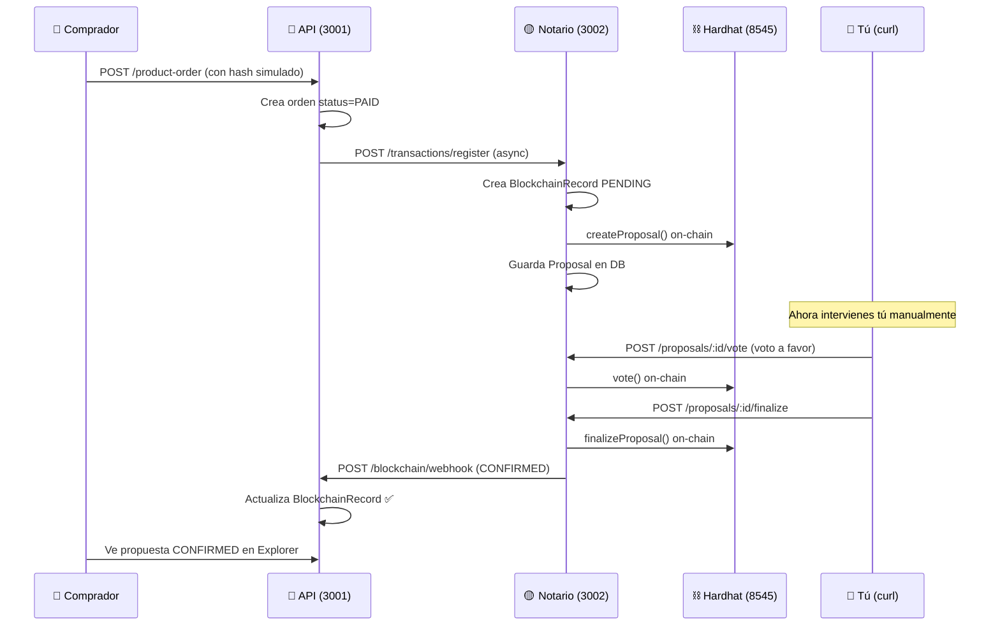

# Plan: Primera Prueba Manual del Flujo Compra + Blockchain

## Flujo Completo



---

## Quién Debe Ser el Elder

El **Elder** es como el "administrador" del consejo de gobernanza. Es el único que puede:
- Finalizar propuestas (aprobar/rechazar)
- Vetar propuestas
- Asignar/quitar roles a otros miembros

Al desplegar el contrato `GovernanceRegistry`, el deployer (Hardhat account #0) se asigna automáticamente como Elder **on-chain** con userId `"SYSTEM_ELDER"`. Pero ese userId no existe en la base de datos PostgreSQL.

**La solución más simple:** Registrar a **uno de tus usuarios reales** de la DB como Elder en el servicio de gobernanza. Eso lo haremos en la Fase 2 — insertamos un `GovernanceMember` con `role: ELDER` directamente en la DB, usando el userId de un usuario que ya tengas registrado (por ejemplo tu cuenta de login).

> [!NOTE]
> El usuario Elder solo necesita existir en la tabla `governance_member` con `role = ELDER`. No necesita tener wallet real — el notario usa la wallet del deployer (account #0 de Hardhat) para firmar todas las transacciones on-chain.

---

## Fase 0: Corregir Configuración de la API

El `.env` actual de la API **solo tiene `DATABASE_URL`**. Faltan las variables de blockchain. Hay que agregarlas.

#### [MODIFY] `apps/api/.env` — Agregar estas líneas:
```env
# JWT (necesarios para que arranque la API)
JWT_SECRET=mi-secreto-dev-123
JWT_REFRESH_SECRET=mi-refresh-secreto-dev-456

# Blockchain Notary Integration
NOTARY_SERVICE_URL=http://localhost:3002/api/v1
NOTARY_API_KEY=apikeyBlockchain
WEBHOOK_BASE_URL=http://localhost:3001
```

> [!CAUTION]
> **Correcciones críticas respecto al `.env.example`:**
> - `NOTARY_SERVICE_URL` debe ser puerto **3002** (no 3001 como dice el example)
> - `WEBHOOK_BASE_URL` debe ser `http://localhost:3001` (sin `/api`) porque la API **no tiene `setGlobalPrefix`** — el webhook controller está en `@Controller('blockchain')` → ruta real: `http://localhost:3001/blockchain/webhook`

---

## Fase 1: Levantar Infraestructura (5 terminales)

### Terminal 1 — Nodo Blockchain Local
```powershell
cd c:\Users\Ultrabook\Documents\amazonIA-marketplace\apps\blockchain-notary
pnpm exec hardhat node
```
Salida esperada: 20 cuentas con ETH. Anotar que la **Account #0** (`0xf39Fd6e51aad88F6F4ce6aB8827279cffFb92266`) es el Elder/deployer.

### Terminal 2 — Desplegar Contrato
```powershell
cd c:\Users\Ultrabook\Documents\amazonIA-marketplace\apps\blockchain-notary
pnpm exec hardhat run scripts/deploy-governance.ts --network localhost
```
Salida esperada: `GovernanceRegistry deployed to: 0x5FbDB2315678afecb367f032d93F642f64180aa3` (u otra dirección).

**Actualizar** la dirección en `apps/blockchain-notary/.env` si es diferente:
```
GOVERNANCE_CONTRACT_ADDRESS=<dirección que salió>
```

### Terminal 3 — Sincronizar Schemas de DB
```powershell
# Schema del notario (tablas de gobernanza)
cd c:\Users\Ultrabook\Documents\amazonIA-marketplace\apps\blockchain-notary
pnpm exec prisma db push

# Schema de la API (BlockchainRecord, ProductOrder, etc.)
cd c:\Users\Ultrabook\Documents\amazonIA-marketplace\apps\api
pnpm exec prisma db push
```

### Terminal 3 (continúa) — Iniciar el Notario
```powershell
cd c:\Users\Ultrabook\Documents\amazonIA-marketplace\apps\blockchain-notary
pnpm run dev
```
Verificar en consola:
```
Blockchain service initialized
Governance Contract: 0x5FbDB...
Wallet: 0xf39Fd6...
```

### Terminal 4 — Iniciar la API
```powershell
cd c:\Users\Ultrabook\Documents\amazonIA-marketplace\apps\api
pnpm run dev
```

### Terminal 5 — Iniciar el Frontend
```powershell
cd c:\Users\Ultrabook\Documents\amazonIA-marketplace\apps\web
pnpm run dev
```

### Smoke Test
```powershell
# Verificar que el notario está healthy
curl.exe -X GET http://localhost:3002/api/v1/health
```
Debe devolver `{ "status": "healthy", "rpcConnected": true, ... }`.

---

## Fase 2: Preparar Datos de Prueba

### 2.1 Obtener un userId existente

Si ya tienes un usuario, puedes consultar su ID. Si no, regístrate desde `http://localhost:3000/register`.

Para obtener el userId, haz login y mira el JWT, o consulta la DB directamente:
```powershell
# Opción: hacer login y ver la respuesta
curl.exe --% -X POST http://localhost:3001/auth/login -H "Content-Type: application/json" -d "{\"email\": \"tu@email.com\", \"password\": \"tupassword\"}"
```
La respuesta incluirá el token JWT. Anota el **userId** (viene en la respuesta o decodifica el JWT).

### 2.2 Registrar el Elder en la DB

Esto es clave. Necesitamos insertar un `GovernanceMember` con `role = ELDER` que apunte a un userId real y a la wallet del deployer (Account #0 de Hardhat).

```powershell
# Usar la API del notario para registrar un miembro
curl.exe --% -X POST http://localhost:3002/api/v1/governance/members -H "Content-Type: application/json" -H "x-api-key: apikeyBlockchain" -d "{\"userId\": \"<TU_USER_ID>\", \"walletAddress\": \"0xf39Fd6e51aad88F6F4ce6aB8827279cffFb92266\"}"
```

> [!WARNING]
> Esto registrará al usuario como `MEMBER` (no como `ELDER`), porque el endpoint `addMember` asigna `role = 1 (MEMBER)` siempre. Para promoverlo a Elder necesitamos actualizar manualmente la DB:

```sql
-- Ejecutar en tu cliente de PostgreSQL (pgAdmin, DBeaver, psql, o Neon Console)
UPDATE governance_member 
SET role = 'ELDER' 
WHERE user_id = '<TU_USER_ID>';
```

**Alternativa sin SQL:** Si prefieres no tocar la DB manualmente, puedo modificar el endpoint del notario para aceptar un parámetro `role` opcional. Pero para la primera prueba, el UPDATE manual es lo más rápido.

### 2.3 Registrar un segundo miembro (votante)

Necesitas al menos **un votante adicional** además del Elder. Usa la Account #1 de Hardhat:

```powershell
curl.exe --% -X POST http://localhost:3002/api/v1/governance/members -H "Content-Type: application/json" -H "x-api-key: apikeyBlockchain" -d "{\"userId\": \"<OTRO_USER_ID>\", \"walletAddress\": \"0x70997970C51812dc3A010C7d01b50e0d17dc79C8\"}"
```

> [!TIP]
> Si no tienes un segundo usuario, puedes registrar otro desde el frontend. O incluso puedes usar solo el Elder para votar y finalizar — el Elder tiene peso de voto = 3 vs Member = 1.

### 2.4 Verificar que existe al menos un producto

Navega a `http://localhost:3000/marketplace` y asegúrate de que hay productos disponibles. Si no hay, necesitarás crear uno (requiere un usuario con rol SELLER).

---

## Fase 3: Ejecutar la Compra

### 3.1 Desde el Frontend

1. Ir a `http://localhost:3000/marketplace`
2. Agregar un producto al carrito
3. Ir a **Checkout** (`/marketplace/checkout`)
4. En el campo **"Hash de Transacción"**, pegar:
   ```
   0xabc123def456789012345678901234567890abcdef1234567890abcdef12345678
   ```
5. Clic en **"Completar Pedido"**

### 3.2 Qué Pasa Automáticamente

| Paso | Qué ocurre | Dónde verificar |
|------|-----------|-----------------|
| 1 | API crea la orden con `status = PAID` | Log de la Terminal 4 (API) |
| 2 | API dispara `notarizeOrder()` (fire-and-forget) | Log: `Sending notarization request for order: <ID>` |
| 3 | Notario recibe la solicitud, responde `202` | Log de la Terminal 3 (Notario) |
| 4 | Notario crea `BlockchainRecord` con status `PENDING` | DB: tabla `blockchain_record` |
| 5 | Notario crea `Proposal` de gobernanza (24h deadline) | Log: `Creating proposal: <ORDER_ID>` |
| 6 | Notario ejecuta `createProposal()` on-chain | Log de la Terminal 1 (Hardhat): `eth_sendTransaction` |

### 3.3 Obtener el ID de la Propuesta

```powershell
curl.exe -X GET "http://localhost:3002/api/v1/governance/proposals" -H "x-api-key: apikeyBlockchain"
```

Busca la propuesta con `status: "PENDING"`. Anota su `proposalId` (que será igual al `orderId` de la compra).

---

## Fase 4: Votación y Finalización Manual

### 4.1 Votar a Favor

```powershell
curl.exe --% -X POST http://localhost:3002/api/v1/governance/proposals/<PROPOSAL_ID>/vote -H "Content-Type: application/json" -H "x-api-key: apikeyBlockchain" -d "{\"voterUserId\": \"<TU_USER_ID_ELDER>\", \"inFavor\": true}"
```

Salida esperada: `{ "success": true, "voteRecord": {...}, "transactionHash": "0x..." }`

En el Hardhat Node (Terminal 1) deberías ver un `eth_sendTransaction` nuevo.

### 4.2 Finalizar la Propuesta

```powershell
curl.exe --% -X POST http://localhost:3002/api/v1/governance/proposals/<PROPOSAL_ID>/finalize -H "Content-Type: application/json" -H "x-api-key: apikeyBlockchain" -d "{\"elderUserId\": \"<TU_USER_ID_ELDER>\"}"
```

### 4.3 Qué Pasa al Finalizar

| Paso | Qué ocurre |
|------|-----------|
| 1 | Notario llama `finalizeProposal()` on-chain |
| 2 | Como `votesFor > votesAgainst` → status = `CONFIRMED` |
| 3 | Actualiza `Proposal` en DB a `CONFIRMED` |
| 4 | Actualiza `BlockchainRecord` con txHash/blockNumber/gasUsed |
| 5 | Envía webhook `POST /blockchain/webhook` a la API |
| 6 | API recibe webhook → actualiza `BlockchainRecord.status = CONFIRMED` |
| 7 | API actualiza `ProductOrder.transactionHash` con el hash de la blockchain |

---

## Fase 5: Verificar el Resultado

### 5.1 Verificar en el Explorer (Frontend)
Navegar a `http://localhost:3000/marketplace/explorer`

La propuesta debería aparecer con estado **CONFIRMED** ✅ con los votos a favor.

### 5.2 Verificar el BlockchainRecord
```powershell
curl.exe -X GET "http://localhost:3002/api/v1/transactions/status/<ORDER_ID>" -H "x-api-key: apikeyBlockchain"
```
Debe mostrar `status: "CONFIRMED"`, `transactionHash: "0x..."`, `blockNumber: N`.

### 5.3 Verificar desde el Explorer API
```powershell
curl.exe -X GET "http://localhost:3001/api/v1/blockchain/explorer/proposals"
```

### 5.4 Verificar los Logs de la Terminal del Hardhat Node
Deberías ver ~3 transacciones:
1. `createProposal` — cuando el notario creó la propuesta
2. `vote` — cuando votaste a favor
3. `finalizeProposal` — cuando finalizaste

---

## Resumen de Comandos en Orden

```
┌────────────────────────────────────────────────────────────────┐
│  PREPARACIÓN                                                    │
│  1. Corregir .env de la API (Fase 0)                           │
│  2. Terminal 1: pnpm exec hardhat node                         │
│  3. Terminal 2: pnpm exec hardhat run scripts/deploy...        │
│  4. Terminal 3: prisma db push (notario + API)                 │
│  5. Terminal 3: pnpm run dev (notario)                         │
│  6. Terminal 4: pnpm run dev (API)                             │
│  7. Terminal 5: pnpm run dev (web)                             │
│  8. Smoke test: curl health                                    │
├────────────────────────────────────────────────────────────────┤
│  DATOS DE PRUEBA                                                │
│  9. Login para obtener userId                                  │
│  10. POST /governance/members (registrar Elder con Account #0) │
│  11. UPDATE governance_member SET role='ELDER' (SQL)           │
│  12. POST /governance/members (registrar votante con Acc #1)   │
├────────────────────────────────────────────────────────────────┤
│  PRUEBA                                                         │
│  13. Comprar producto desde el frontend (con hash simulado)    │
│  14. GET /governance/proposals (obtener proposalId)            │
│  15. POST /proposals/:id/vote (votar a favor)                  │
│  16. POST /proposals/:id/finalize (finalizar como Elder)       │
├────────────────────────────────────────────────────────────────┤
│  VERIFICACIÓN                                                   │
│  17. GET /transactions/status/:orderId (status CONFIRMED?)     │
│  18. Abrir http://localhost:3000/marketplace/explorer           │
│  19. Revisar logs del Hardhat Node (3 transacciones)           │
└────────────────────────────────────────────────────────────────┘
```
